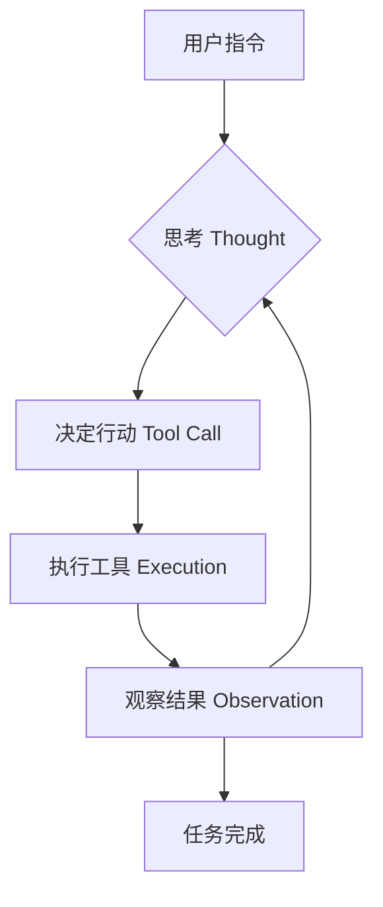

# Claude Code 深度解析（上）：从 Copilot 到 Agentic Workflow

> **定位**：面向工程师的深度技术分享，不教 `npm install`，拆解架构。
>
> **Author**: [Shucheng Yin](https://github.com/yinshucheng)（尹树成）
>
> **Date**: 2026-01

---

## 1. 范式转移：AI Coding 的三个阶段

不要把 Claude Code 仅仅看作一个 CLI 工具。它代表了 AI 辅助编程的**第三阶段**：

* **Phase 1: Copilot (Autocomplete)**
  * 模式：你写，它补。
  * 核心：Next Token Prediction。
  * 局限：Context 极小，无全局视野。
* **Phase 2: Cursor (Chat in IDE)**
  * 模式：你问，它答/改。
  * 核心：RAG + Edit。
  * 局限：被动响应，缺乏主动探索能力。
* **Phase 3: Claude Code (Agentic Workflow)**
  * 模式：**你给目标，它负责交付。**
  * 核心：**Agent Loop (ReAct) + Tool Use**。
  * 本质：它是一个拥有**手脚（Tools）**和**感官（Read）**的独立开发者，而不仅仅是一个文本生成器。

**为什么这很重要？**

Claude Code 的价值不在于它能写快排，而在于它展示了 **LLM 如何与现实世界交互**的最佳实践。理解它的架构，就理解了 Agent 系统的核心范式。

---

## 2. 架构解剖：Agent Loop

Claude Code 不是一次性生成代码，而是运行在一个 **OODA Loop** (Observe-Orient-Decide-Act) 中：



**关键技术点**：
* **Chain of Thought (CoT)**: 强制模型在行动前输出思考过程，减少幻觉。
* **Error Recovery**: 如果工具执行报错（如 `file not found`），Agent 会读取错误信息，修正路径，重试。这是 Copilot 做不到的。

---

## 3. Context Management：如何理解百万行代码？

Claude Code 没有魔法，它不能把整个 Repo 塞进 Context Window。它模仿了人类工程师探索代码库的行为：

1. **Exploration**: 先看目录结构。
2. **Search**: 搜索关键词。
3. **Read**: 只读取相关文件的内容。
4. **Memory**: 维护一个 `CLAUDE.md` 作为长期记忆（Project Context）。

**启示**：做 Agent 时，不要试图做超大 RAG，而是要给 Agent 提供**检索工具**，让它学会自己找答案。

### CLAUDE.md：项目的"海马体"

如果说 Context Window 是**工作记忆**（短期），那么 `CLAUDE.md` 就是项目的**长期记忆**（海马体）。

* **机制**：启动时，自动寻找根目录下的 `CLAUDE.md`，将其内容**无条件注入**到 System Prompt 的最前端。
* **价值**：
  * **Context 预热**：无需每次对话都重复 "这是一个 Python 项目，使用 Poetry..."。
  * **规范对齐**：比 Linter 更灵活的自然语言规范。
  * **知识沉淀**：记录项目的"潜规则"。

**最佳实践 (Context Engineering)**：

* **High Density**: 保持精简。Token 很贵，不要写废话。
* **Negative Constraints**: 明确告诉它**不要做什么**（e.g. "不要使用 `any` 类型"），这比告诉它做什么更有效。
* **Dynamic Update**: 允许 Agent 在解决复杂问题后，将获得的 Insight 回写到 `CLAUDE.md` 中，实现**记忆巩固**。

---

## 4. 核心概念辨析：Agent vs Slash Command vs MCP vs Skills

这四个概念容易混淆。它们都是"扩展"，但层级完全不同。

| 概念 | 角色类比 | 定义 | 核心特征 |
|:--|:--|:--|:--|
| **Agent** | 人类员工 | 拥有自主决策能力的智能体 | 自主性 (Autonomy) |
| **Slash Command** | 快捷宏指令 | 触发特定硬编码逻辑的快捷键 | 确定性 (Deterministic) |
| **Skills** | SOP手册 | 封装好的 Prompt + Workflow | 流程化 (Procedural) |
| **MCP** | USB接口 | 连接外部系统的标准化协议 | 互操作性 (Interoperability) |

### 它们如何协同工作？

> * **Agent** 是大厨。
> * **MCP** 是冰箱里的食材和厨房里的厨具（原子能力）。
> * **Skills** 是菜谱（SOP）。
> * **Slash Command** 是厨房的灯光开关（系统控制）。

**工作流**：
用户输入 `/onboard` (Skill) → Agent 读取菜谱 → Agent 决定先用 `git-mcp` 拉代码，再用 `fs-mcp` 改配置 → 任务完成。

---

## 5. 从 API 视角理解 Claude Code

虽然在 Agent Loop 中会多次调用模型，但 LLM 本质上是无状态的。每次循环，都要把完整的上下文重新发给模型：

```json
{
  "model": "claude-sonnet-4-20250514",
  "max_tokens": 16000,
  "system": [
    // ① 基础 System Prompt（Claude Code 内置）
    "You are Claude Code, an AI assistant...",
    // ② CLAUDE.md 内容（项目记忆）
    "Project context from CLAUDE.md: ..."
  ],
  "tools": [
    // ③ MCP 提供的工具定义
    {"name": "read_file", "description": "...", "input_schema": {}},
    {"name": "bash", "description": "...", "input_schema": {}},
    {"name": "query_db", "description": "...", "input_schema": {}}
  ],
  "messages": [
    // ④ 对话历史
    {"role": "user", "content": "帮我修复登录 Bug"},
    {"role": "assistant", "content": "...", "tool_use": {}},
    {"role": "user", "content": [{"type": "tool_result"}]},
    // ⑤ Skills 触发时，会注入额外指令
    {"role": "user", "content": "[Skill: /review-pr] Follow these steps: 1. ..."}
  ]
}
```

**各组件在 API 中的位置：**

| 组件 | 位置 | 注入时机 |
|:--|:--|:--|
| System Prompt | `system` 字段 | 每次请求 |
| CLAUDE.md | `system` 字段追加 | 启动时读取 |
| MCP Tools | `tools` 字段 | 启动时加载 |
| MCP Resources | `messages` 中作为 context | 通过 Tool 调用读取 |
| Skills | `messages` 中作为 user 指令 | 触发时注入 |
| 对话历史 | `messages` 字段 | 累积 |

**关键洞察**：
* `tools` 是独立字段，模型看到工具定义后决定是否调用
* Tool 调用结果作为 `tool_result` 回到 `messages`，形成循环
* Skills 本质是"预设的 user 指令"，通过 ICL 约束模型行为
* CLAUDE.md 是"持久化的 system prompt 片段"

---

## 6. 使用心态与原则

### 核心心态转变

| 旧思维 | 新思维 |
|:--|:--|
| "我来写代码" | "我来设计任务，Agent 来执行" |
| "AI 是搜索引擎" | "AI 是初级工程师，需要明确指令" |
| "一次性给完整需求" | "小步快跑，迭代验证" |
| "出错了就放弃" | "出错是正常的，看它如何自愈" |
| "我要控制每一步" | "给目标，让它自己规划路径" |

### 高效使用的五个原则

1. **先设计后执行** — 不要直接说"帮我写一个 XX"。先用 Plan 模式讨论方案，确认后再执行。
2. **小步快跑** — 复杂任务拆成小块，每块验证后再继续。
3. **提供充足上下文** — 告诉它项目背景、技术栈、约束条件。
4. **信任但验证** — 让它先跑，看结果再调整。不要每一步都打断它。
5. **写进 CLAUDE.md** — 反复出现的规范写进项目记忆，下次自动生效。

### 自举学习：用 Claude Code 学 Claude Code

Claude Code 团队已经用 Claude Code 开发 Claude Code 本身。最快学习路径：**用它来学它。**

```
# 关于基础使用
> 你有哪些能力？能帮我做什么？
> 怎么用你最高效？有什么最佳实践？

# 关于工作原理（适合做 Agent 的同学）
> 你是怎么理解一个陌生代码库的？
> 你的 Agent Loop 是怎么工作的？
> 你是怎么决定什么时候读文件、什么时候搜索的？

# 关于扩展能力
> MCP 是什么？怎么扩展你的能力？
> Skills 和 MCP 有什么区别？
```

---

## 7. 今天马上就能做的事

**5 分钟体验**：

```bash
npm install -g @anthropic-ai/claude-code
cd your-project
claude
> 这个项目最复杂的部分是什么？为什么？
```

看它如何自己探索代码库、读文件、得出结论。这不是搜索，是思考。

**10 分钟惊叹**：

```bash
# 找一个你一直想修但懒得修的 Bug
> 用户反馈 XXX 功能有问题，帮我定位并修复
```

看它如何从零开始：定位问题 → 分析原因 → 提出方案 → 写代码 → 自己测试。

---

*下篇预告：[Claude Code 深度解析（下）：MCP、Skills 与上下文工程](02-claude-code-deep-dive-part2.md) — 深入 MCP 协议实战、Skills 渐进式加载机制、上下文工程的算法视角。*

---

*[Builder Notes](https://github.com/yinshucheng/builder-notes) by [Shucheng Yin](https://github.com/yinshucheng)*
